# 🕵️‍♀️ 02 · Auditoria Interna de Verificação de Controles

> Seis meses depois da Matriz de Risco: os controles prometidos saíram do papel?

| | |
|---|---|
| 🗂️ **Tipo** | Projeto simulado |
| 📚 **Referências** | ISO 19011 (processo de auditoria) · COBIT 2019, MEA02 (monitoramento de controle interno) |
| 📦 **Entregáveis** | Relatório de Auditoria · Registro de Não Conformidade · Parecer final |
| ⏱️ **Prazo simulado** | 1 semana |

---

## 🏢 Cenário

O cliente estratégico da **CloudFlux** renovou o contrato após o [Projeto 01](../01-matriz-de-risco/), mas com uma condição: uma reavaliação formal em seis meses, para confirmar que os controles do plano de tratamento funcionam na prática.

🚨 **O gatilho:** o prazo venceu. O board pediu uma auditoria interna para verificar, **com evidência**, se cada controle foi implementado e continua operando, e não apenas marcado como concluído.

📌 **Papel:** analista júnior de GRC conduzindo verificação de controle, e não auditora sênior certificada.

📌 **Critério de status:**
- 🟢 **Conforme:** implementado e funcionando.
- 🟡 **Conforme com ressalva:** implementado, mas com falha.
- 🔴 **Não conforme:** não implementado.

---

## 🗓️ Como a auditoria foi conduzida

A estrutura seguiu as quatro fases da ISO 19011, usadas como referência e não aplicadas cláusula a cláusula.

| Fase | Dias | Foco |
|---|:---:|---|
| 1 · Planejamento | 1–2 | Comunicado formal às áreas (TI, RH, Jurídico e Board), reuniões de alinhamento e solicitação de acessos, logs e documentos |
| 2 · Coleta de evidências | 3–4 | Recebimento e organização do material; análise de logs, atas e relatórios |
| 3 · Avaliação | 5 | Classificação de cada controle contra o critério e mapeamento de causa raiz |
| 4 · Reporte | 6–7 | Apresentação ao Board e devolutiva para cada área, com as ações corretivas |

---

## 📋 Resultado por controle

| Controle | O que deveria existir | Status | Achado |
|---|---|:---:|---|
| Gestão de acesso | Política de RBAC com privilégio mínimo para os 180 colaboradores | 🟡 | RBAC em rascunho (v0.3), cobrindo só Engenharia e Produto, sem aprovação da diretoria e sem revisão periódica de acessos |
| Segurança na nuvem | WAF homologado e monitoramento contínuo da camada de aplicação | 🔴 | WAF ativo apenas em staging; em produção, 0 de 42 regras aplicadas |
| Segurança do servidor | Política de manutenção contínua com atualização automática | 🟢 | Patches aplicados por rotina automatizada (cron), com relatório e validação via SSH |
| Segurança de rede | Arquitetura padrão de rede e VPN obrigatória no modelo híbrido | 🟢 | VPN homologada e monitorada, com logs do concentrador e controle de usuários ativos |
| Segurança de dados | Classificação de dados e teste automatizado de restauração de backup | 🟡 | Backup em execução, mas o último teste de restauração foi manual, em 14/04/2026, fora da periodicidade trimestral |
| Cultura de segurança | Programa contínuo de treinamento, com phishing simulado de 2 a 3 vezes por ano | 🟡 | Um único ciclo (mar/2026), com 60% de adesão e 29% de cliques; segunda rodada não executada |
| Recuperação de desastres | DRP homologado via consultoria, com teste anual | 🔴 | Não existe DRP; a proposta de consultoria (R$ 68 mil) foi reprovada pela CFO no Q1/2026 |
| Riscos de terceiros | Política de terceiros com questionário de homologação e cláusulas de privacidade | 🔴 | Homologação nunca entrou na rotina de compras; contratos vigentes sem cláusulas de segurança da informação e LGPD |

### 📊 Placar

| 🟢 Conforme | 🟡 Com ressalva | 🔴 Não conforme |
|:---:|:---:|:---:|
| **2** (25%) | **3** (37,5%) | **3** (37,5%) |

---

## 🔎 Evidências

As evidências cobrem os dois tipos de verificação:
- 🧪 **Técnica** (logs, painéis, rotinas agendadas): produzida em um **laboratório em container Docker**, montado para simular o ambiente da CloudFlux.
- 📄 **Documental** (políticas, atas, propostas, contratos, e-mails): simulada para o cenário.

Clique em cada controle para abrir.

🔐 Gestão de acesso

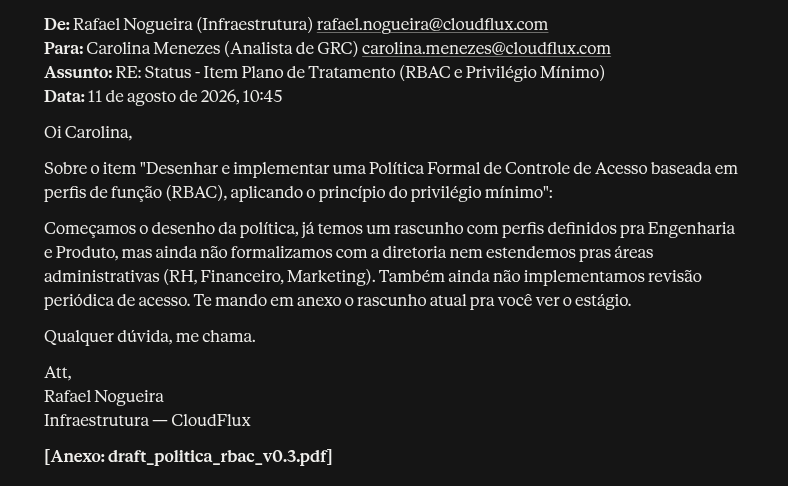

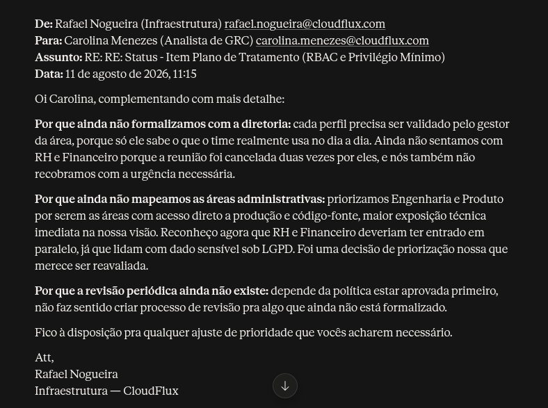

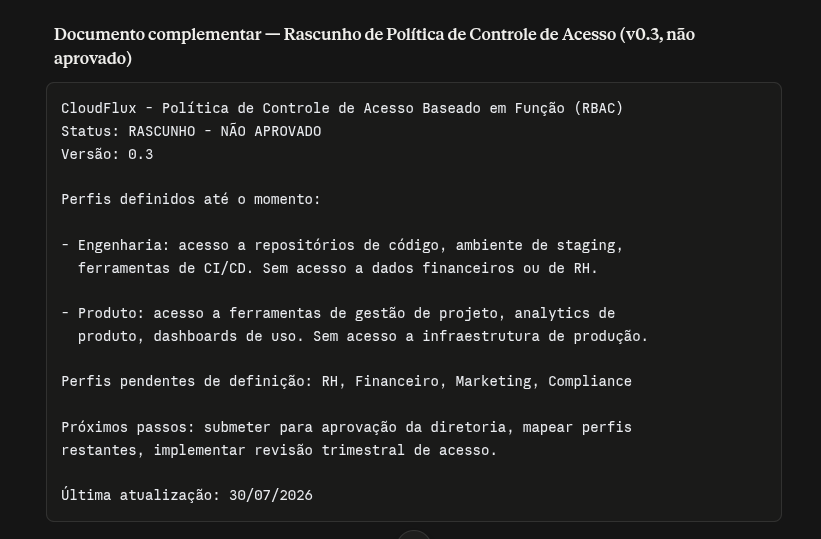

☁️ Segurança na nuvem

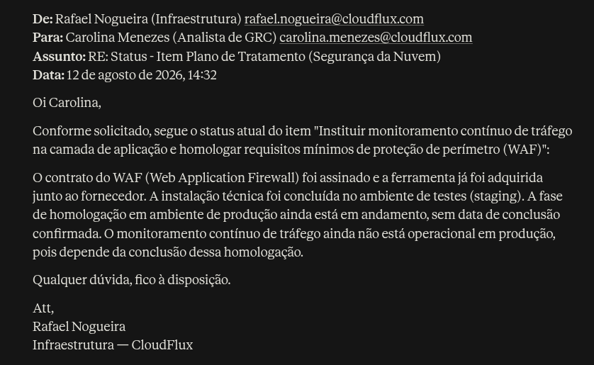

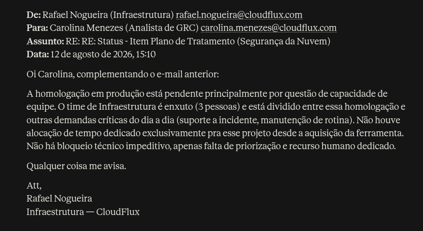

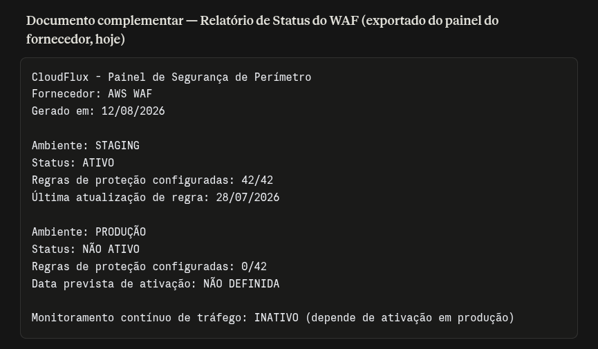

🖥️ Segurança do servidor

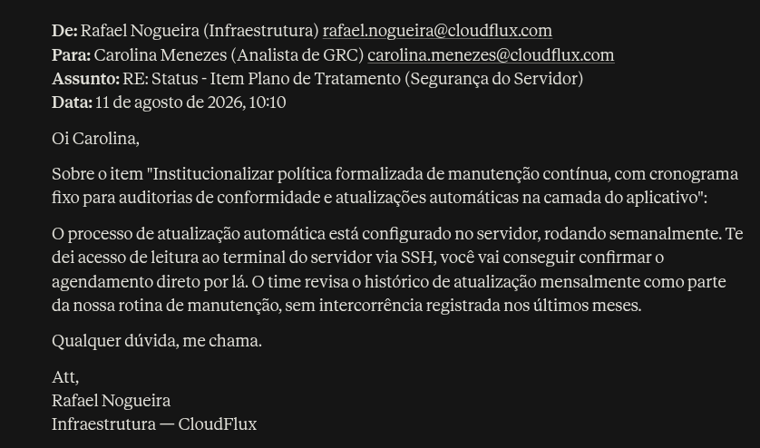

**Execução manual:**

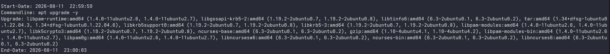

**Execução agendada:**

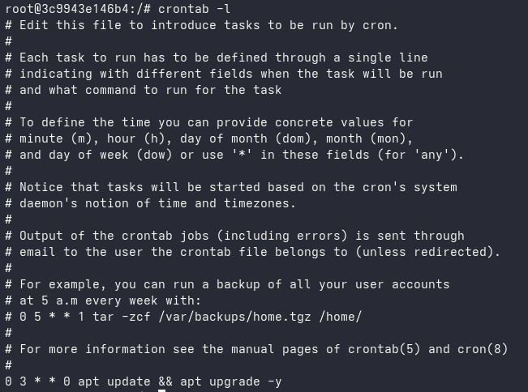

🌐 Segurança de rede

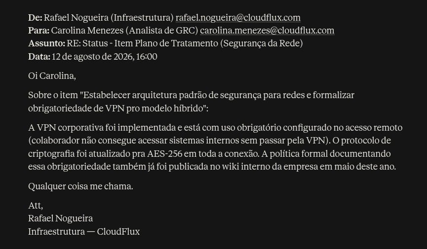

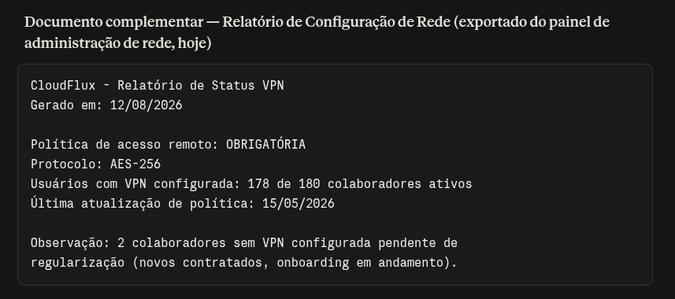

💾 Segurança de dados

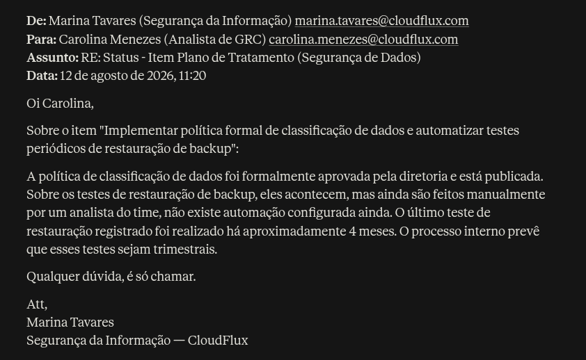

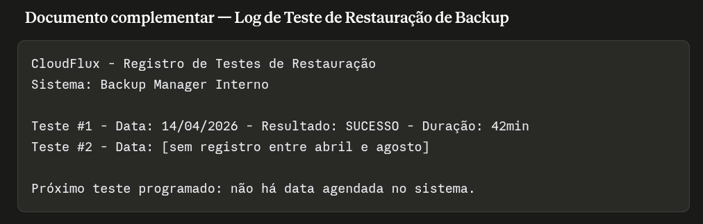

🎓 Cultura de segurança

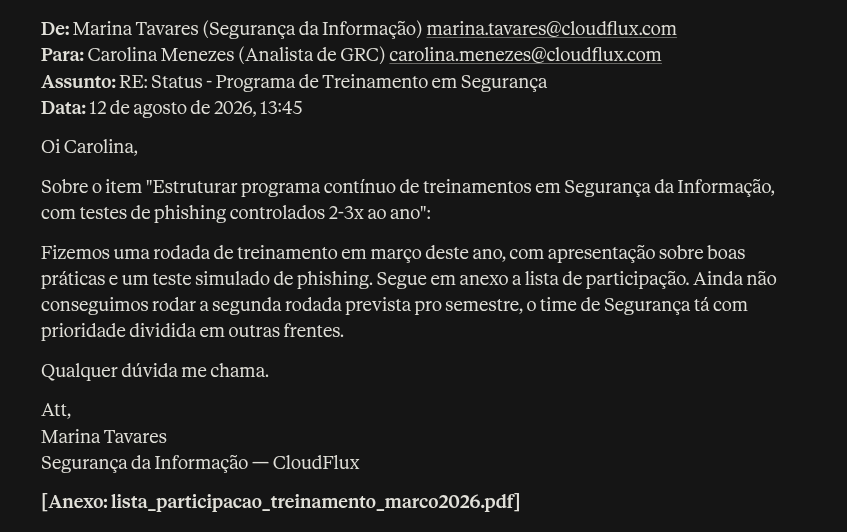

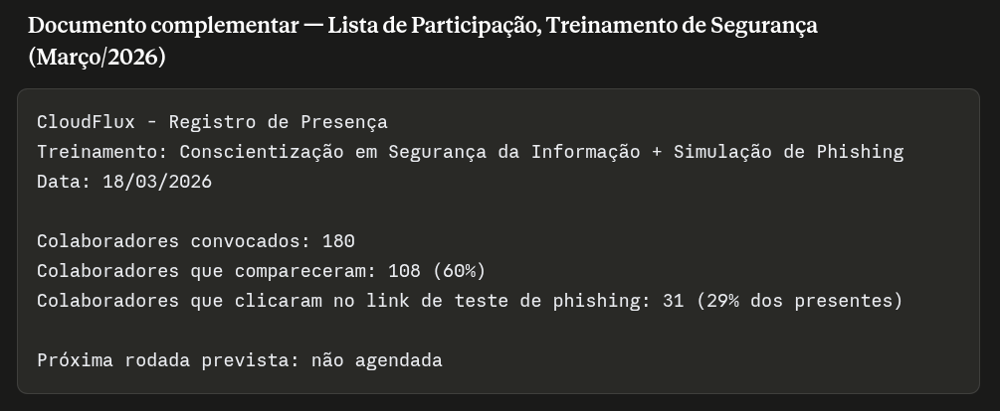

🚑 Recuperação de desastres

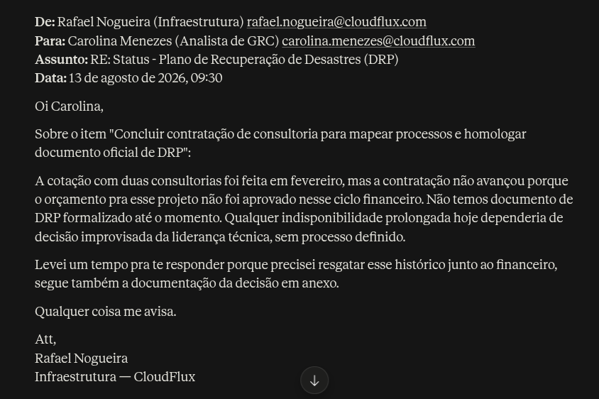

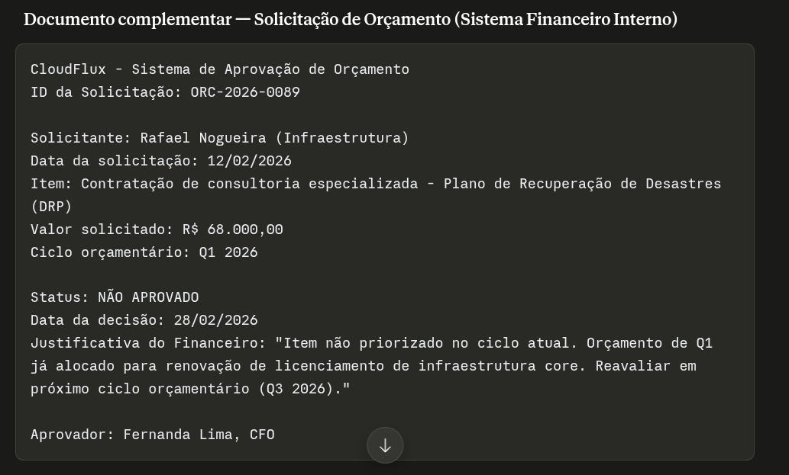

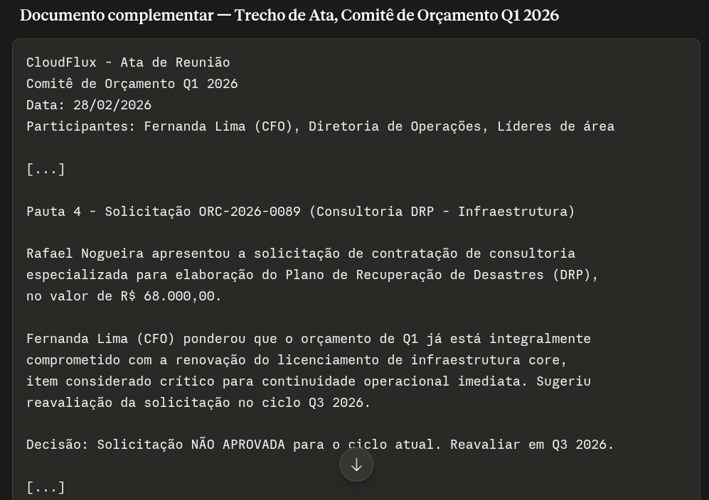

🤝 Riscos de terceiros

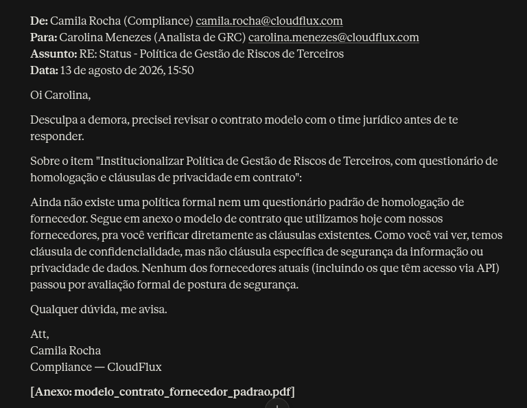

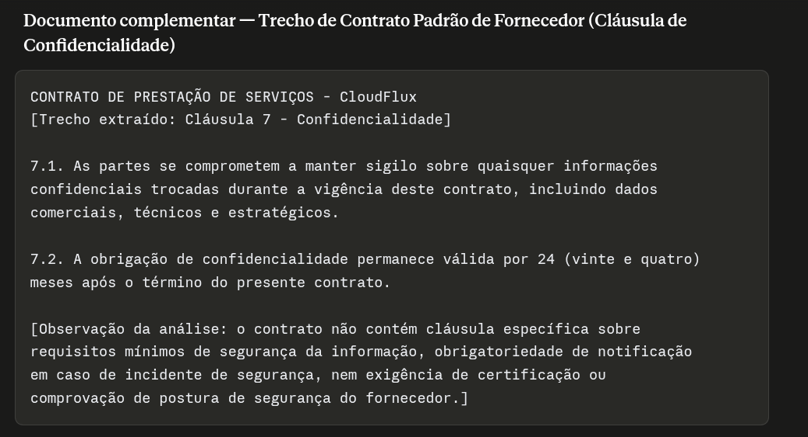

---

## 🧾 Registro de Não Conformidade

Os seis controles que não passaram viraram RNCs, cada um com causa raiz e dois níveis de ação.

| RNC | Controle | Causa raiz | ⚡ Ação imediata (contenção) | 🏗️ Ação estrutural (definitiva) |
|---|---|---|---|---|
| 01 | Gestão de acesso 🟡 | Falta de governança na publicação de políticas; RH e Financeiro fora do mapeamento de perfis | Reunião entre TI, RH e Financeiro para validar os acessos dessas áreas | Política de RBAC v1.0 aprovada pela diretoria, com revisão trimestral automatizada de privilégios |
| 02 | Segurança na nuvem 🔴 | Infraestrutura com apenas 3 pessoas, que priorizou chamados operacionais | Suporte temporário para ativar o pacote básico OWASP Top 10 em produção | Deploy completo das regras, alertas em tempo real e revisão do dimensionamento da equipe |
| 03 | Segurança de dados 🟡 | Dependência de execução manual e ausência de calendário de testes | Teste emergencial de restauração na semana, registrando tempo de recuperação (RTO/RPO) | Scripts de restauração automatizada e relatório trimestral de integridade |
| 04 | Cultura de segurança 🟡 | Falta de acompanhamento do plano e de cobrança da liderança | Relançar o treinamento para os 40% pendentes e reforço para quem clicou na simulação | Calendário semestral na plataforma de RH/LMS, com meta de 90% de adesão |
| 05 | Recuperação de desastres 🔴 | Restrição orçamentária e desalinhamento entre gestão de risco e aprovação financeira | Playbook interno simplificado de continuidade, com os procedimentos mínimos de contingência | Reenviar a verba do DRP com prioridade na revisão orçamentária do Q3/2026, vinculada às exigências dos clientes B2B |
| 06 | Riscos de terceiros 🔴 | Compras descentralizadas, focadas só em aspectos financeiros e comerciais | Questionário simplificado de postura de segurança para os 10 fornecedores mais críticos | Política de terceiros, anexo padrão de proteção de dados (DPA) nas novas contratações e aditivo nos contratos vigentes |

### 🧩 Causas transversais

A análise cruzada mostrou que as não conformidades nascem de dois fatores:
- 👥 **Capacidade operacional:** a equipe de Infraestrutura tem 3 pessoas e está sobrecarregada, o que represou o WAF em produção e a automação dos testes de backup.
- 💰 **Governança financeira:** o corte orçamentário travou a contratação do DRP.

---

## ⚖️ Parecer final

A CloudFlux **não tem maturidade suficiente para declarar conformidade total** de segurança e continuidade ao cliente. O WAF inativo em produção e a ausência de DRP expõem a operação a riscos significativos de indisponibilidade e de incidente de segurança.

**Recomendação:**
- 🪟 **Transparência controlada:** não afirmar que todos os controles estão 100% operacionais. Apresentar este relatório junto com o Plano de Ação Corretiva, demonstrando governança e compromisso com melhoria contínua.
- 🚀 **Recursos emergenciais:** apoio temporário à Infraestrutura para ativar o WAF em produção em até 30 dias, e reavaliação da verba do DRP (R$ 68 mil) no Q3/2026 como investimento em retenção de contas B2B.
- 🔁 **Re-auditoria em 45 dias**, para verificar a execução das ações de contenção.

---

## ✅ O que este projeto demonstra

- Diferenciar **controle documentado** de **controle operando**, com evidência técnica e documental.
- Aplicar o ciclo da ISO 19011 (planejar, coletar, avaliar e reportar) e a lógica de monitoramento do COBIT MEA02.
- **Análise de causa raiz** por não conformidade, incluída por iniciativa própria, além do escopo definido para o nível júnior.
- Parecer honesto para o board, conectando o investimento pendente à retenção de receita.

## 🔜 Desdobramentos na série CloudFlux

- 🛠️ A ativação do WAF em produção, pedida na RNC 02, passa por change management formal em **[03 · Change Management via ServiceNow](../03-change-management-servicenow/)**.
- 🚨 A VPN, declarada conforme nesta auditoria, mostra uma lacuna de enforcement durante o incidente de **[04 · Gestão de Incidente via Jira](../04-gestao-de-incidente-jira/)**. É o limite entre controle declarado e controle validado tecnicamente.
- 🔐 A RNC 01 (RBAC em rascunho) é finalmente fechada em **[05 · Gestão de Acesso via Keycloak](../05-gestao-de-acesso-keycloak/)**.
